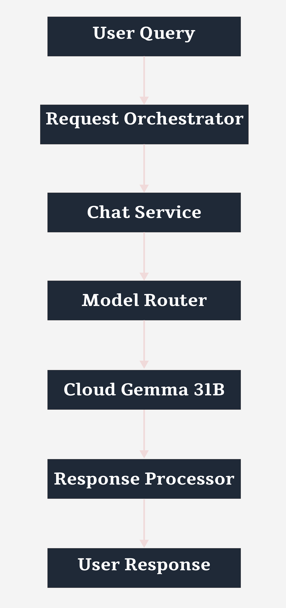
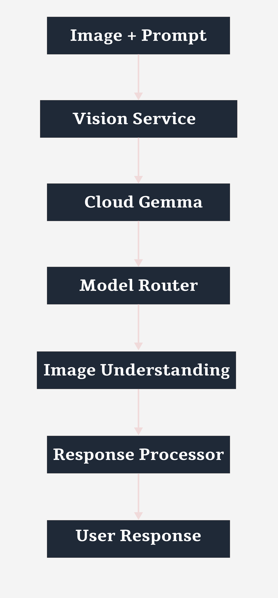
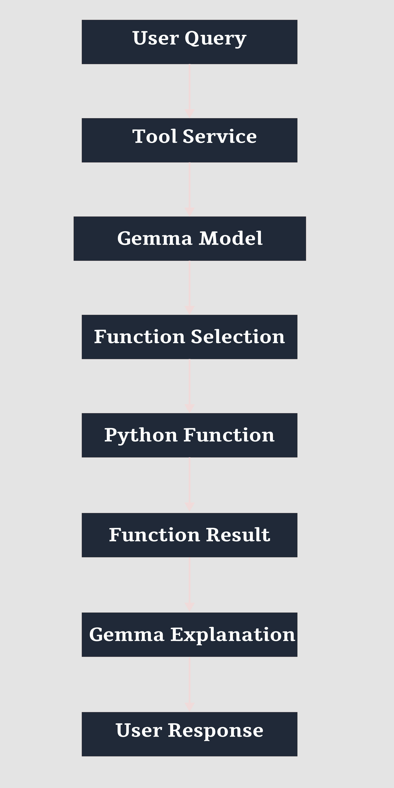

# GemmaX ChatCore

<p align="center">
  
</p>

<h1 align="center">GemmaX ChatCore</h1>

<p align="center">
  <strong>Hybrid Multimodal AI Experimentation Platform</strong>
</p>

<p align="center">
  Cloud Inference • Local JAX Execution • Vision Understanding • Function Calling
</p>

---

## Overview

GemmaX ChatCore is a hybrid multimodal AI experimentation platform designed to explore modern AI application architectures using the Gemma ecosystem. The platform integrates cloud-hosted and locally executed Gemma models into a unified workflow supporting conversational AI, image understanding, multi-turn interactions, and tool-augmented reasoning.

The project was built to study practical AI engineering concepts such as hybrid inference architectures, multimodal processing, conversational memory, model orchestration, and function calling.

---

## Problem Statement

Developers working with modern large language models often face fragmented workflows when comparing cloud-hosted and locally executed models. Evaluating tradeoffs such as latency, cost, privacy, multimodal capability, and deployment flexibility typically requires switching between multiple tools and environments.

Most AI chat interfaces abstract these architectural decisions away, making it difficult to understand how inference environments impact system behavior and user experience.

GemmaX ChatCore was developed to provide a unified experimentation platform that enables exploration of cloud and local Gemma models while supporting conversational AI, image understanding, multi-turn interactions, and tool-augmented reasoning.

---

## Engineering Objectives

* Design a modular AI application architecture.
* Explore hybrid inference strategies using cloud and local models.
* Implement multimodal workflows supporting text and image inputs.
* Integrate function calling into conversational interactions.
* Study engineering tradeoffs between different inference environments.
* Build a maintainable and extensible AI system.

---

## Key Features

* Hybrid Cloud and Local Inference
* Multimodal Text and Image Understanding
* Multi-Turn Conversational Memory
* Function Calling Support
* JAX-Based Local Model Execution
* Google GenAI API Integration
* Structured Response Processing
* Layered System Architecture

---

# System Architecture

GemmaX ChatCore follows a layered architecture that separates user interaction, orchestration, service execution, model inference, and response processing.

<p align="center">
  
</p>

### Architecture Layers

**Presentation Layer**

* User interaction
* Text input handling
* Image upload support
* Response visualization

**Request Orchestrator**

* Input validation
* Request classification
* Prompt construction
* Context management
* Request routing

**Service Layer**

* Chat Service
* Vision Service
* Tool Service

**Model Router**

* Cloud vs Local inference selection
* Resource-aware routing

**Inference Layer**

* Cloud-hosted Gemma models
* Local Gemma execution using JAX

**Response Processor**

* Output formatting
* Response rendering
* Function result interpretation

---

# Workflow Diagrams

## Cloud Chat Workflow

<p align="center">
  
</p>

Handles conversational interactions through cloud-hosted Gemma models.

---

## Vision Workflow

<p align="center">
  
</p>

Processes multimodal image understanding requests.

---

## Function Calling Workflow

<p align="center">
  
</p>

Enables tool-augmented reasoning through external Python functions.

---

# Architectural Highlights

### Separation of Concerns

Each layer is responsible for a clearly defined responsibility, improving maintainability and extensibility.

### Hybrid Inference Strategy

Cloud and local inference environments are integrated into a unified architecture, enabling comparative experimentation.

### Service-Oriented Processing

Chat, vision, and tool workflows are implemented independently while sharing common orchestration and routing infrastructure.

### Extensible Design

Additional models, tools, and workflows can be integrated with minimal architectural changes.

---

# Design Decisions

### Why Hybrid Inference?

Cloud-hosted models provide advanced reasoning and multimodal capabilities, while local models offer privacy, offline execution, and reduced operational cost.

### Why JAX?

JAX provides efficient execution for Gemma models while supporting hardware acceleration and scalable numerical computation.

### Why Function Calling?

Function calling extends model capabilities beyond text generation by enabling interaction with deterministic external systems and tools.

---

# Tradeoff Analysis

| Cloud Inference          | Local Inference        |
| ------------------------ | ---------------------- |
| Higher capability models | Greater privacy        |
| Large context windows    | Offline availability   |
| Managed infrastructure   | Full execution control |
| API dependency           | Resource constrained   |
| Scalable deployment      | Lower operational cost |

---

# Technology Stack

## AI & Machine Learning

* Gemma Models
* Google GenAI SDK
* JAX
* Keras Hub

## Programming Language

* Python

## Development Environment

* Google Colab
* KaggleHub

## Supporting Libraries

* NumPy
* Pillow
* Requests
* CurrencyConverter

---

# Project Structure

```text
GemmaX_ChatCore/
│
├── Outputs/
├── assets/
├── docs/
│   ├── architecture.png
│   ├── cloud-chat-flow.png
│   ├── vision-flow.png
│   └── function-calling-flow.png
│
├── notebooks/
│   └── GemmaX_ChatCore.ipynb
│
├── LICENSE
└── README.md
```

---

# Future Improvements

* Retrieval-Augmented Generation (RAG)
* Vector Database Integration
* Persistent Memory Systems
* Automated Model Routing
* Multi-Agent Workflows
* Web-Based User Interface
* Evaluation and Benchmarking Framework

---

# Contributors

### Jibitesh Kumar Mishra
### Ankita Singh

Developed collaboratively as an exploration of multimodal AI systems and hybrid inference architectures.

---

# License

This project is released under the MIT License.
